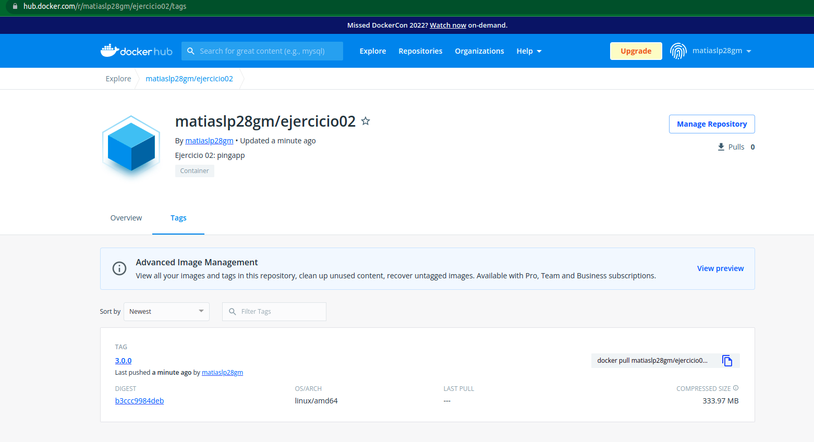

# Ejercicio 2

El ejercicio consiste en descargar la imagen `nicopaez/pingapp:3.0.0` y re-tagearla con el nuevo `usuario/repositorio:tag`. Para eso debemos loguearnos con nuestro usuario en el CLI de Docker.
Como tag deje el mismo `3.0.0`
Los comandos utilizados y su salida fueron:

```bash
$ docker login
Login with your Docker ID to push and pull images from Docker Hub. If you don't have a Docker ID, head over to https://hub.docker.com to create one.
Username: matiaslp28gm
Password: 
Login Succeeded

Logging in with your password grants your terminal complete access to your account. 
For better security, log in with a limited-privilege personal access token. Learn more at https://docs.docker.com/go/access-tokens/


$ docker pull nicopaez/pingapp:3.0.0
3.0.0: Pulling from nicopaez/pingapp
f15005b0235f: Pull complete 
41ebfd3d2fd0: Pull complete 
b998346ba308: Pull complete 
f01ec562c947: Pull complete 
2447a2c11907: Pull complete 
1915e6344d7f: Pull complete 
c252862c152e: Pull complete 
352f88e533dc: Pull complete 
296ea9472022: Pull complete 
c1390338b41c: Pull complete 
89430077ae85: Pull complete 
2bafd3ee090a: Pull complete 
Digest: sha256:b3ccc9984deb6eb1dfd9ce172f29c38651902ece467c666f6e585ddf9ba4adb5
Status: Downloaded newer image for nicopaez/pingapp:3.0.0
docker.io/nicopaez/pingapp:3.0.0

$ docker tag nicopaez/pingapp:3.0.0 matiaslp28gm/ejercicio02:3.0.0

$ docker push matiaslp28gm/ejercicio02:3.0.0
The push refers to repository [docker.io/matiaslp28gm/ejercicio02]
ba79cea50eb3: Mounted from nicopaez/pingapp 
ff5b4dd0fa87: Mounted from nicopaez/pingapp 
7b49ec019b87: Mounted from nicopaez/pingapp 
fc09db109f07: Mounted from nicopaez/pingapp 
e3328cdb9fc9: Mounted from nicopaez/pingapp 
d69503d78f37: Mounted from nicopaez/pingapp 
96b6dd776a23: Mounted from nicopaez/pingapp 
5900cd753a41: Mounted from nicopaez/pingapp 
afae6f50abb9: Mounted from nicopaez/pingapp 
136a15f81f25: Mounted from nicopaez/pingapp 
185574602537: Mounted from nicopaez/pingapp 
24efcd549ab5: Mounted from nicopaez/pingapp 
3.0.0: digest: sha256:b3ccc9984deb6eb1dfd9ce172f29c38651902ece467c666f6e585ddf9ba4adb5 size: 2839

```

En [https://hub.docker.com/r/matiaslp28gm/ejercicio02/tags](https://hub.docker.com/r/matiaslp28gm/ejercicio02/tags) se puede ver el repositorio, con los tags, y la última vez actualizado.



También en esa url se puede copiar el comando para descargar la imagen

```bash
docker pull matiaslp28gm/ejercicio02:3.0.0
```

Luego ejecuté `docker rmi -f $(docker images -aq)` para eliminar todas las imágenes (y no afecte los layers cacheados) y chequear que lo podía descargar y ejecutar correctamente. 

```bash
$ docker pull matiaslp28gm/ejercicio02:3.0.0
3.0.0: Pulling from matiaslp28gm/ejercicio02
f15005b0235f: Pull complete 
41ebfd3d2fd0: Pull complete 
b998346ba308: Pull complete 
f01ec562c947: Pull complete 
2447a2c11907: Pull complete 
1915e6344d7f: Pull complete 
c252862c152e: Pull complete 
352f88e533dc: Pull complete 
296ea9472022: Pull complete 
c1390338b41c: Pull complete 
89430077ae85: Pull complete 
2bafd3ee090a: Pull complete 
Digest: sha256:b3ccc9984deb6eb1dfd9ce172f29c38651902ece467c666f6e585ddf9ba4adb5
Status: Downloaded newer image for matiaslp28gm/ejercicio02:3.0.0
docker.io/matiaslp28gm/ejercicio02:3.0.0


$ docker run matiaslp28gm/ejercicio02:3.0.0
== Sinatra (v2.0.5) has taken the stage on 4567 for development with backup from Thin
^C== Sinatra has ended his set (crowd applauds)
Thin web server (v1.7.2 codename Bachmanity)
Maximum connections set to 1024
Listening on 0.0.0.0:4567, CTRL+C to stop
Stopping ...
Stopping ...
Stopping ...

```