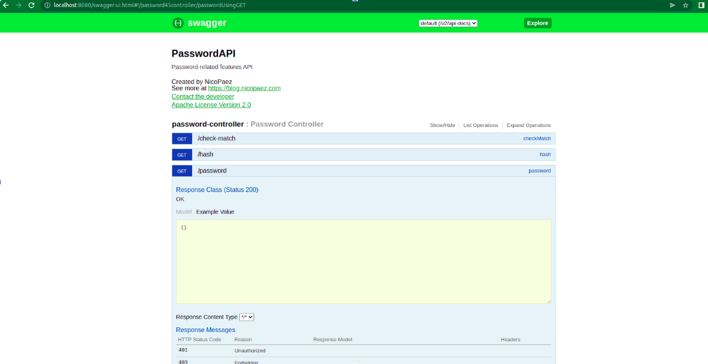

# Ejercicio 04: creación de imagen PasswordAPI

Para poder seleccionar la imagen base, estuve viendo que versiones de java existen, con cuales anda el archivo `passwordapi.jar`, cuales son LTS, cuando termina el soporte y cuanto pesa la imagen. 
De las versiones de java, la `17`, la `11`, la `8` y son `LTS`. La que tiene mas vida es la `8` (hasta 2030).
Para probar con cual andaba, traté de usar lo que aprendimos hasta ahora: ejecutaba un container a partir de la imagen `openjdk:VERSION`, montando en un volumen la carpeta con el archivo `passwordapi.jar` en la carpeta /app/, mapeando los puertos e indicando el comando para iniciar el proyecto.
De estas pruebas, se obtuvo que con `17` no funciona, y si con `11` y `8`:

* Version 17
El container crashea:
`docker run -p 8080:8080 -v $PWD/:/app openjdk:17 java -jar /app/passwordapi.jar`
```bash
  .   ____          _            __ _ _
 /\\ / ___'_ __ _ _(_)_ __  __ _ \ \ \ \
( ( )\___ | '_ | '_| | '_ \/ _` | \ \ \ \
 \\/  ___)| |_)| | | | | || (_| |  ) ) ) )
  '  |____| .__|_| |_|_| |_\__, | / / / /
 =========|_|==============|___/=/_/_/_/
 :: Spring Boot ::        (v2.0.3.RELEASE)

2022-06-16 23:15:07.565  INFO 1 --- [           main] com.nicopaez.passwordapi.Application     : Starting Application v1.5.0 on d5cdc8df25ce with PID 1 (/app/passwordapi.jar started by root in /)
2022-06-16 23:15:07.568  INFO 1 --- [           main] com.nicopaez.passwordapi.Application     : No active profile set, falling back to default profiles: default
2022-06-16 23:15:07.633  INFO 1 --- [           main] ConfigServletWebServerApplicationContext : Refreshing org.springframework.boot.web.servlet.context.AnnotationConfigServletWebServerApplicationContext@402a079c: startup date [Thu Jun 16 23:15:07 UTC 2022]; root of context hierarchy
2022-06-16 23:15:08.583 ERROR 1 --- [           main] o.s.boot.SpringApplication               : Application run failed

java.lang.IllegalStateException: Cannot load configuration class: com.nicopaez.passwordapi.Application
        at org.springframework.context.annotation.ConfigurationClassPostProcessor.enhanceConfigurationClasses(ConfigurationClassPostProcessor.java:414) ~[spring-context-5.0.7.RELEASE.jar!/:5.0.7.RELEASE]
        at org.springframework.context.annotation.ConfigurationClassPostProcessor.postProcessBeanFactory(ConfigurationClassPostProcessor.java:254) ~[spring-context-5.0.7.RELEASE.jar!/:5.0.7.RELEASE]
        at org.springframework.context.support.PostProcessorRegistrationDelegate.invokeBeanFactoryPostProcessors(PostProcessorRegistrationDelegate.java:284) ~[spring-context-5.0.7.RELEASE.jar!/:5.0.7.RELEASE]
        at org.springframework.context.support.PostProcessorRegistrationDelegate.invokeBeanFactoryPostProcessors(PostProcessorRegistrationDelegate.java:128) ~[spring-context-5.0.7.RELEASE.jar!/:5.0.7.RELEASE]
        at org.springframework.context.support.AbstractApplicationContext.invokeBeanFactoryPostProcessors(AbstractApplicationContext.java:694) ~[spring-context-5.0.7.RELEASE.jar!/:5.0.7.RELEASE]
        at org.springframework.context.support.AbstractApplicationContext.refresh(AbstractApplicationContext.java:532) ~[spring-context-5.0.7.RELEASE.jar!/:5.0.7.RELEASE]
        at org.springframework.boot.web.servlet.context.ServletWebServerApplicationContext.refresh(ServletWebServerApplicationContext.java:140) ~[spring-boot-2.0.3.RELEASE.jar!/:2.0.3.RELEASE]
        at org.springframework.boot.SpringApplication.refresh(SpringApplication.java:759) ~[spring-boot-2.0.3.RELEASE.jar!/:2.0.3.RELEASE]
        at org.springframework.boot.SpringApplication.refreshContext(SpringApplication.java:395) ~[spring-boot-2.0.3.RELEASE.jar!/:2.0.3.RELEASE]
        at org.springframework.boot.SpringApplication.run(SpringApplication.java:327) ~[spring-boot-2.0.3.RELEASE.jar!/:2.0.3.RELEASE]
        at org.springframework.boot.SpringApplication.run(SpringApplication.java:1255) ~[spring-boot-2.0.3.RELEASE.jar!/:2.0.3.RELEASE]
        at org.springframework.boot.SpringApplication.run(SpringApplication.java:1243) ~[spring-boot-2.0.3.RELEASE.jar!/:2.0.3.RELEASE]
        at com.nicopaez.passwordapi.Application.main(Application.java:13) ~[classes!/:1.5.0]
        at java.base/jdk.internal.reflect.NativeMethodAccessorImpl.invoke0(Native Method) ~[na:na]
        at java.base/jdk.internal.reflect.NativeMethodAccessorImpl.invoke(NativeMethodAccessorImpl.java:77) ~[na:na]
        at java.base/jdk.internal.reflect.DelegatingMethodAccessorImpl.invoke(DelegatingMethodAccessorImpl.java:43) ~[na:na]
        at java.base/java.lang.reflect.Method.invoke(Method.java:568) ~[na:na]
        at org.springframework.boot.loader.MainMethodRunner.run(MainMethodRunner.java:48) ~[passwordapi.jar:1.5.0]
        at org.springframework.boot.loader.Launcher.launch(Launcher.java:87) ~[passwordapi.jar:1.5.0]
        at org.springframework.boot.loader.Launcher.launch(Launcher.java:50) ~[passwordapi.jar:1.5.0]
        at org.springframework.boot.loader.JarLauncher.main(JarLauncher.java:51) ~[passwordapi.jar:1.5.0]
Caused by: java.lang.ExceptionInInitializerError: null
        at org.springframework.context.annotation.ConfigurationClassEnhancer.newEnhancer(ConfigurationClassEnhancer.java:122) ~[spring-context-5.0.7.RELEASE.jar!/:5.0.7.RELEASE]
        at org.springframework.context.annotation.ConfigurationClassEnhancer.enhance(ConfigurationClassEnhancer.java:110) ~[spring-context-5.0.7.RELEASE.jar!/:5.0.7.RELEASE]
        at org.springframework.context.annotation.ConfigurationClassPostProcessor.enhanceConfigurationClasses(ConfigurationClassPostProcessor.java:403) ~[spring-context-5.0.7.RELEASE.jar!/:5.0.7.RELEASE]
        ... 20 common frames omitted
Caused by: org.springframework.cglib.core.CodeGenerationException: java.lang.reflect.InaccessibleObjectException-->Unable to make protected final java.lang.Class java.lang.ClassLoader.defineClass(java.lang.String,byte[],int,int,java.security.ProtectionDomain) throws java.lang.ClassFormatError accessible: module java.base does not "opens java.lang" to unnamed module @424c0bc4
        at org.springframework.cglib.core.ReflectUtils.defineClass(ReflectUtils.java:464) ~[spring-core-5.0.7.RELEASE.jar!/:5.0.7.RELEASE]
        at org.springframework.cglib.core.AbstractClassGenerator.generate(AbstractClassGenerator.java:336) ~[spring-core-5.0.7.RELEASE.jar!/:5.0.7.RELEASE]
        at org.springframework.cglib.core.AbstractClassGenerator$ClassLoaderData$3.apply(AbstractClassGenerator.java:93) ~[spring-core-5.0.7.RELEASE.jar!/:5.0.7.RELEASE]
        at org.springframework.cglib.core.AbstractClassGenerator$ClassLoaderData$3.apply(AbstractClassGenerator.java:91) ~[spring-core-5.0.7.RELEASE.jar!/:5.0.7.RELEASE]
        at org.springframework.cglib.core.internal.LoadingCache$2.call(LoadingCache.java:54) ~[spring-core-5.0.7.RELEASE.jar!/:5.0.7.RELEASE]
        at java.base/java.util.concurrent.FutureTask.run(FutureTask.java:264) ~[na:na]
        at org.springframework.cglib.core.internal.LoadingCache.createEntry(LoadingCache.java:61) ~[spring-core-5.0.7.RELEASE.jar!/:5.0.7.RELEASE]
        at org.springframework.cglib.core.internal.LoadingCache.get(LoadingCache.java:34) ~[spring-core-5.0.7.RELEASE.jar!/:5.0.7.RELEASE]
        at org.springframework.cglib.core.AbstractClassGenerator$ClassLoaderData.get(AbstractClassGenerator.java:116) ~[spring-core-5.0.7.RELEASE.jar!/:5.0.7.RELEASE]
        at org.springframework.cglib.core.AbstractClassGenerator.create(AbstractClassGenerator.java:291) ~[spring-core-5.0.7.RELEASE.jar!/:5.0.7.RELEASE]
        at org.springframework.cglib.core.KeyFactory$Generator.create(KeyFactory.java:221) ~[spring-core-5.0.7.RELEASE.jar!/:5.0.7.RELEASE]
        at org.springframework.cglib.core.KeyFactory.create(KeyFactory.java:174) ~[spring-core-5.0.7.RELEASE.jar!/:5.0.7.RELEASE]
        at org.springframework.cglib.core.KeyFactory.create(KeyFactory.java:153) ~[spring-core-5.0.7.RELEASE.jar!/:5.0.7.RELEASE]
        at org.springframework.cglib.proxy.Enhancer.<clinit>(Enhancer.java:73) ~[spring-core-5.0.7.RELEASE.jar!/:5.0.7.RELEASE]
        ... 23 common frames omitted
Caused by: java.lang.reflect.InaccessibleObjectException: Unable to make protected final java.lang.Class java.lang.ClassLoader.defineClass(java.lang.String,byte[],int,int,java.security.ProtectionDomain) throws java.lang.ClassFormatError accessible: module java.base does not "opens java.lang" to unnamed module @424c0bc4
        at java.base/java.lang.reflect.AccessibleObject.checkCanSetAccessible(AccessibleObject.java:354) ~[na:na]
        at java.base/java.lang.reflect.AccessibleObject.checkCanSetAccessible(AccessibleObject.java:297) ~[na:na]
        at java.base/java.lang.reflect.Method.checkCanSetAccessible(Method.java:199) ~[na:na]
        at java.base/java.lang.reflect.Method.setAccessible(Method.java:193) ~[na:na]
        at org.springframework.cglib.core.ReflectUtils$1.run(ReflectUtils.java:61) ~[spring-core-5.0.7.RELEASE.jar!/:5.0.7.RELEASE]
        at java.base/java.security.AccessController.doPrivileged(AccessController.java:569) ~[na:na]
        at org.springframework.cglib.core.ReflectUtils.<clinit>(ReflectUtils.java:52) ~[spring-core-5.0.7.RELEASE.jar!/:5.0.7.RELEASE]
        at org.springframework.cglib.core.KeyFactory$Generator.generateClass(KeyFactory.java:243) ~[spring-core-5.0.7.RELEASE.jar!/:5.0.7.RELEASE]
        at org.springframework.cglib.core.DefaultGeneratorStrategy.generate(DefaultGeneratorStrategy.java:25) ~[spring-core-5.0.7.RELEASE.jar!/:5.0.7.RELEASE]
        at org.springframework.cglib.core.AbstractClassGenerator.generate(AbstractClassGenerator.java:329) ~[spring-core-5.0.7.RELEASE.jar!/:5.0.7.RELEASE]
        ... 35 common frames omitted

2022-06-16 23:15:08.584  INFO 1 --- [           main] ConfigServletWebServerApplicationContext : Closing org.springframework.boot.web.servlet.context.AnnotationConfigServletWebServerApplicationContext@402a079c: startup date [Thu Jun 16 23:15:07 UTC 2022]; root of context hierarchy
```
* Version 11
El proyecto funciona correctamente,puedo acceder a `http:\\localhost:8080`:
`docker run -p 8080:8080 -v $PWD/:/app openjdk:11 java -jar /app/passwordapi.jar`
```bash
  .   ____          _            __ _ _
 /\\ / ___'_ __ _ _(_)_ __  __ _ \ \ \ \
( ( )\___ | '_ | '_| | '_ \/ _` | \ \ \ \
 \\/  ___)| |_)| | | | | || (_| |  ) ) ) )
  '  |____| .__|_| |_|_| |_\__, | / / / /
 =========|_|==============|___/=/_/_/_/
 :: Spring Boot ::        (v2.0.3.RELEASE)

2022-06-16 23:11:39.512  INFO 1 --- [           main] com.nicopaez.passwordapi.Application     : Starting Application v1.5.0 on d077edbd18f5 with PID 1 (/app/passwordapi.jar started by root in /)
2022-06-16 23:11:39.516  INFO 1 --- [           main] com.nicopaez.passwordapi.Application     : No active profile set, falling back to default profiles: default
2022-06-16 23:11:39.586  INFO 1 --- [           main] ConfigServletWebServerApplicationContext : Refreshing org.springframework.boot.web.servlet.context.AnnotationConfigServletWebServerApplicationContext@7c29daf3: startup date [Thu Jun 16 23:11:39 UTC 2022]; root of context hierarchy
WARNING: An illegal reflective access operation has occurred
WARNING: Illegal reflective access by org.springframework.cglib.core.ReflectUtils$1 (jar:file:/app/passwordapi.jar!/BOOT-INF/lib/spring-core-5.0.7.RELEASE.jar!/) to method java.lang.ClassLoader.defineClass(java.lang.String,byte[],int,int,java.security.ProtectionDomain)
WARNING: Please consider reporting this to the maintainers of org.springframework.cglib.core.ReflectUtils$1
WARNING: Use --illegal-access=warn to enable warnings of further illegal reflective access operations
WARNING: All illegal access operations will be denied in a future release
2022-06-16 23:11:41.019  INFO 1 --- [           main] o.s.b.w.embedded.tomcat.TomcatWebServer  : Tomcat initialized with port(s): 8080 (http)
2022-06-16 23:11:41.049  INFO 1 --- [           main] o.apache.catalina.core.StandardService   : Starting service [Tomcat]
2022-06-16 23:11:41.050  INFO 1 --- [           main] org.apache.catalina.core.StandardEngine  : Starting Servlet Engine: Apache Tomcat/8.5.31
2022-06-16 23:11:41.062  INFO 1 --- [ost-startStop-1] o.a.catalina.core.AprLifecycleListener   : The APR based Apache Tomcat Native library which allows optimal performance in production environments was not found on the java.library.path: [/usr/java/packages/lib:/usr/lib64:/lib64:/lib:/usr/lib]
2022-06-16 23:11:41.135  INFO 1 --- [ost-startStop-1] o.a.c.c.C.[Tomcat].[localhost].[/]       : Initializing Spring embedded WebApplicationContext
2022-06-16 23:11:41.136  INFO 1 --- [ost-startStop-1] o.s.web.context.ContextLoader            : Root WebApplicationContext: initialization completed in 1556 ms
2022-06-16 23:11:41.701  INFO 1 --- [ost-startStop-1] o.s.b.w.servlet.ServletRegistrationBean  : Servlet dispatcherServlet mapped to [/]
2022-06-16 23:11:41.704  INFO 1 --- [ost-startStop-1] o.s.b.w.servlet.FilterRegistrationBean   : Mapping filter: 'characterEncodingFilter' to: [/*]
2022-06-16 23:11:41.704  INFO 1 --- [ost-startStop-1] o.s.b.w.servlet.FilterRegistrationBean   : Mapping filter: 'hiddenHttpMethodFilter' to: [/*]
2022-06-16 23:11:41.704  INFO 1 --- [ost-startStop-1] o.s.b.w.servlet.FilterRegistrationBean   : Mapping filter: 'httpPutFormContentFilter' to: [/*]
2022-06-16 23:11:41.704  INFO 1 --- [ost-startStop-1] o.s.b.w.servlet.FilterRegistrationBean   : Mapping filter: 'requestContextFilter' to: [/*]
2022-06-16 23:11:41.704  INFO 1 --- [ost-startStop-1] o.s.b.w.servlet.FilterRegistrationBean   : Mapping filter: 'httpTraceFilter' to: [/*]
2022-06-16 23:11:41.705  INFO 1 --- [ost-startStop-1] o.s.b.w.servlet.FilterRegistrationBean   : Mapping filter: 'webMvcMetricsFilter' to: [/*]
2022-06-16 23:11:42.051  INFO 1 --- [           main] s.w.s.m.m.a.RequestMappingHandlerMapping : Mapped "{[/],methods=[GET]}" onto public org.springframework.web.servlet.view.RedirectView com.nicopaez.passwordapi.PasswordController.index()
2022-06-16 23:11:42.052  INFO 1 --- [           main] s.w.s.m.m.a.RequestMappingHandlerMapping : Mapped "{[/hash],methods=[GET]}" onto public java.util.Map<java.lang.String, java.lang.Object> com.nicopaez.passwordapi.PasswordController.hash(java.lang.String)
2022-06-16 23:11:42.053  INFO 1 --- [           main] s.w.s.m.m.a.RequestMappingHandlerMapping : Mapped "{[/valid],methods=[GET]}" onto public java.util.Map<java.lang.String, java.lang.Object> com.nicopaez.passwordapi.PasswordController.valid(java.lang.String)
2022-06-16 23:11:42.053  INFO 1 --- [           main] s.w.s.m.m.a.RequestMappingHandlerMapping : Mapped "{[/password],methods=[GET]}" onto public java.util.Map<java.lang.String, java.lang.Object> com.nicopaez.passwordapi.PasswordController.password()
2022-06-16 23:11:42.053  INFO 1 --- [           main] s.w.s.m.m.a.RequestMappingHandlerMapping : Mapped "{[/check-match],methods=[GET]}" onto public java.util.Map<java.lang.String, java.lang.Object> com.nicopaez.passwordapi.PasswordController.checkMatch(java.lang.String,java.lang.String)
2022-06-16 23:11:42.059  INFO 1 --- [           main] s.w.s.m.m.a.RequestMappingHandlerMapping : Mapped "{[/swagger-resources/configuration/security]}" onto public org.springframework.http.ResponseEntity<springfox.documentation.swagger.web.SecurityConfiguration> springfox.documentation.swagger.web.ApiResourceController.securityConfiguration()
2022-06-16 23:11:42.060  INFO 1 --- [           main] s.w.s.m.m.a.RequestMappingHandlerMapping : Mapped "{[/swagger-resources]}" onto public org.springframework.http.ResponseEntity<java.util.List<springfox.documentation.swagger.web.SwaggerResource>> springfox.documentation.swagger.web.ApiResourceController.swaggerResources()
2022-06-16 23:11:42.061  INFO 1 --- [           main] s.w.s.m.m.a.RequestMappingHandlerMapping : Mapped "{[/swagger-resources/configuration/ui]}" onto public org.springframework.http.ResponseEntity<springfox.documentation.swagger.web.UiConfiguration> springfox.documentation.swagger.web.ApiResourceController.uiConfiguration()
2022-06-16 23:11:42.065  INFO 1 --- [           main] s.w.s.m.m.a.RequestMappingHandlerMapping : Mapped "{[/error]}" onto public org.springframework.http.ResponseEntity<java.util.Map<java.lang.String, java.lang.Object>> org.springframework.boot.autoconfigure.web.servlet.error.BasicErrorController.error(javax.servlet.http.HttpServletRequest)
2022-06-16 23:11:42.065  INFO 1 --- [           main] s.w.s.m.m.a.RequestMappingHandlerMapping : Mapped "{[/error],produces=[text/html]}" onto public org.springframework.web.servlet.ModelAndView org.springframework.boot.autoconfigure.web.servlet.error.BasicErrorController.errorHtml(javax.servlet.http.HttpServletRequest,javax.servlet.http.HttpServletResponse)
2022-06-16 23:11:42.176  INFO 1 --- [           main] o.s.b.a.e.web.EndpointLinksResolver      : Exposing 2 endpoint(s) beneath base path '/actuator'
2022-06-16 23:11:42.188  INFO 1 --- [           main] s.b.a.e.w.s.WebMvcEndpointHandlerMapping : Mapped "{[/actuator/health],methods=[GET],produces=[application/vnd.spring-boot.actuator.v2+json || application/json]}" onto public java.lang.Object org.springframework.boot.actuate.endpoint.web.servlet.AbstractWebMvcEndpointHandlerMapping$OperationHandler.handle(javax.servlet.http.HttpServletRequest,java.util.Map<java.lang.String, java.lang.String>)
2022-06-16 23:11:42.189  INFO 1 --- [           main] s.b.a.e.w.s.WebMvcEndpointHandlerMapping : Mapped "{[/actuator/info],methods=[GET],produces=[application/vnd.spring-boot.actuator.v2+json || application/json]}" onto public java.lang.Object org.springframework.boot.actuate.endpoint.web.servlet.AbstractWebMvcEndpointHandlerMapping$OperationHandler.handle(javax.servlet.http.HttpServletRequest,java.util.Map<java.lang.String, java.lang.String>)
2022-06-16 23:11:42.190  INFO 1 --- [           main] s.b.a.e.w.s.WebMvcEndpointHandlerMapping : Mapped "{[/actuator],methods=[GET],produces=[application/vnd.spring-boot.actuator.v2+json || application/json]}" onto protected java.util.Map<java.lang.String, java.util.Map<java.lang.String, org.springframework.boot.actuate.endpoint.web.Link>> org.springframework.boot.actuate.endpoint.web.servlet.WebMvcEndpointHandlerMapping.links(javax.servlet.http.HttpServletRequest,javax.servlet.http.HttpServletResponse)
2022-06-16 23:11:42.327  INFO 1 --- [           main] pertySourcedRequestMappingHandlerMapping : Mapped URL path [/v2/api-docs] onto method [public org.springframework.http.ResponseEntity<springfox.documentation.spring.web.json.Json> springfox.documentation.swagger2.web.Swagger2Controller.getDocumentation(java.lang.String,javax.servlet.http.HttpServletRequest)]
2022-06-16 23:11:42.418  INFO 1 --- [           main] o.s.w.s.handler.SimpleUrlHandlerMapping  : Mapped URL path [/**/favicon.ico] onto handler of type [class org.springframework.web.servlet.resource.ResourceHttpRequestHandler]
2022-06-16 23:11:42.560  INFO 1 --- [           main] s.w.s.m.m.a.RequestMappingHandlerAdapter : Looking for @ControllerAdvice: org.springframework.boot.web.servlet.context.AnnotationConfigServletWebServerApplicationContext@7c29daf3: startup date [Thu Jun 16 23:11:39 UTC 2022]; root of context hierarchy
2022-06-16 23:11:42.617  INFO 1 --- [           main] o.s.w.s.handler.SimpleUrlHandlerMapping  : Mapped URL path [/webjars/**] onto handler of type [class org.springframework.web.servlet.resource.ResourceHttpRequestHandler]
2022-06-16 23:11:42.617  INFO 1 --- [           main] o.s.w.s.handler.SimpleUrlHandlerMapping  : Mapped URL path [/**] onto handler of type [class org.springframework.web.servlet.resource.ResourceHttpRequestHandler]
2022-06-16 23:11:42.886  INFO 1 --- [           main] o.s.j.e.a.AnnotationMBeanExporter        : Registering beans for JMX exposure on startup
2022-06-16 23:11:42.897  INFO 1 --- [           main] o.s.c.support.DefaultLifecycleProcessor  : Starting beans in phase 2147483647
2022-06-16 23:11:42.897  INFO 1 --- [           main] d.s.w.p.DocumentationPluginsBootstrapper : Context refreshed
2022-06-16 23:11:42.918  INFO 1 --- [           main] d.s.w.p.DocumentationPluginsBootstrapper : Found 1 custom documentation plugin(s)
2022-06-16 23:11:42.963  INFO 1 --- [           main] s.d.s.w.s.ApiListingReferenceScanner     : Scanning for api listing references
2022-06-16 23:11:43.086  INFO 1 --- [           main] o.s.b.w.embedded.tomcat.TomcatWebServer  : Tomcat started on port(s): 8080 (http) with context path ''
2022-06-16 23:11:43.091  INFO 1 --- [           main] com.nicopaez.passwordapi.Application     : Started Application in 3.905 seconds (JVM running for 4.328)
Password API is now running
```
* Version 8
El proyecto funciona correctamente, puedo acceder a `http:\\localhost:8080`:
`docker run -p 8080:8080 -v $PWD/:/app openjdk:8 java -jar /app/passwordapi.jar`
Se omite el log.

## Selección de imagen
Las imagenes que se descargaron son muy pesadas.
Estuve explorando distintos tags para la imagen `openjdk` en las versiones `11` y `8` en la [pagina oficial](https://hub.docker.com/_/openjdk?tab=tags) y tiene muchisimos, no pude determinar cual era la mejor, pero estuve haciendo pruebas buscando `slim` y `alpine`.
Otra cosa que vi que en la pagina de dockerhub el tamaño que provee es `COMPRESSED SIZE` y no el tamaño real de la imagen.
Estas son las imagenes que estuve probando y su peso.
```bash
$ docker images | grep openjdk
openjdk                                            8                             5bf086edab5e   3 weeks ago     526MB
openjdk                                            11                            72d6966f5c18   3 weeks ago     660MB
openjdk                                            11-slim                       d9a67f2011da   3 weeks ago     429MB
openjdk                                            17                            5e28ba2b4cdb   7 weeks ago     471MB
openjdk                                            8-alpine                      a3562aa0b991   3 years ago     105MB

```

La imagen que menos pesaba era el tag `8-alpine` (105MB), asi que considere que esa era la mejor imagen base.

# Build

Luego de crear el dockerfile, se realizo el build con el comando, directamente generando el tag.
Use el `--no-cache` para que no reutilice nada de lo que ya venia probando haciendo el build de este ejercicio:
```bash
$ docker build -f Dockerfile -t matiaslp28gm/passwordapi:8-alpine . --no-cache
Sending build context to Docker daemon  25.43MB
Step 1/4 : FROM openjdk:8-alpine
 ---> a3562aa0b991
Step 2/4 : COPY passwordapi.jar /app/
 ---> 396860884e2f
Step 3/4 : WORKDIR /app
 ---> Running in 0007c828387d
Removing intermediate container 0007c828387d
 ---> 0247c5d4107c
Step 4/4 : CMD ["java", "-jar", "passwordapi.jar"]
 ---> Running in d5605731359a
Removing intermediate container d5605731359a
 ---> 2ecd5fef90ff
Successfully built 2ecd5fef90ff
Successfully tagged matiaslp28gm/passwordapi:8-alpine
```

Luego se pusheo, y se genero automaticamente el repositorio en [https://hub.docker.com/r/matiaslp28gm/passwordapi/tags](https://hub.docker.com/r/matiaslp28gm/passwordapi/tags):
```bash
$ docker push matiaslp28gm/passwordapi:8-alpine
The push refers to repository [docker.io/matiaslp28gm/passwordapi]
b2d8c180ef23: Pushed 
ceaf9e1ebef5: Mounted from library/openjdk 
9b9b7f3d56a0: Mounted from library/openjdk 
f1b5933fe4b5: Mounted from library/openjdk 
8-alpine: digest: sha256:9ddafd372cd5dd063f88ff56b91cf87ca36b83514499dee0da182c17e741d14f size: 1159
```

Luego probe ejecutar un container (en modo desatachado) a partir de la imagen generada, y probar haciendo un curl para ver si respondia y accediendo desde el navegador:

```bash
$ docker run -d -p 8080:8080 matiaslp28gm/passwordapi:8-alpine
daa6a6741f647c9c1806f804ad0dced50896f6616608e8b7d000dbe48990b01f

$ curl localhost:8080/password
{"password":"wtlojgvtgulsnnncincm"}
```


