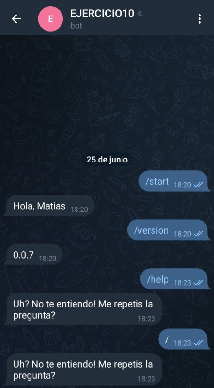

# Ejercicio 10

Luego de crear el bot, directamente cree el esqueleto del deployment con kubectl:
```bash
microk8s.kubectl create deployment ejercicio10 --image=nicopaez/telegrambot:0.0.7 --dry-run=client -oyaml > deployment.yml
```

Siguiendo la forma de definir variables de entorno para un pod, edite el archivo `deployment.yml`:
https://kubernetes.io/docs/tasks/inject-data-application/define-environment-variable-container/


Aplicamos y vemos que este corriendo el pod:
```bash
$ microk8s.kubectl apply -f deployment.yml 
deployment.apps/ejercicio10 created

$ microk8s.kubectl get pods
NAME                                       READY   STATUS    RESTARTS        AGE
ejercicio10-57d6549564-c6t5f               1/1     Running   0               49s

$ microk8s.kubectl logs ejercicio10-57d6549564-c6t5f
I, [2022-06-25T21:17:58.392806 #1]  INFO -- : Starting bot version:0.0.7
I, [2022-06-25T21:17:58.392867 #1]  INFO -- : token is 545<<HIDDEN>>GBVM
I, [2022-06-25T21:17:58.392893 #1]  INFO -- : Starting bot
```

Y luego la conversacion con el bot:

