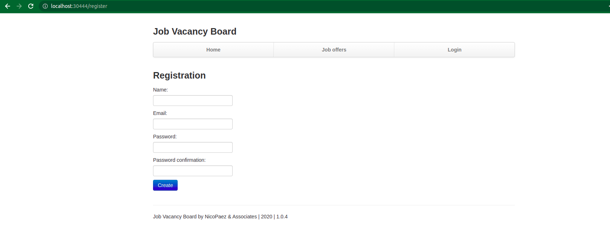

# Ejercicio 12

Luego de leer sobre lo minimo necesario para levantar un postgres en docker, https://hub.docker.com/_/postgres decidi setear solamente la variable de entorno POSTGRES_PASSWORD -> password1, y lo demas dejarlo por defecto.

Cree el configmap y los secrets necesarios para los proyectos (los nombres salen del manifest que ya existe), y cree un secret extra para el deployment de la db.
Para hacerlo tuve que transformar tanto el password como el string de conexion a la db a base64
```bash
$ echo -n postgresql://postgres:password1@db:/postgres | base64
cG9zdGdyZXNxbDovL3Bvc3RncmVzOnBhc3N3b3JkMUBkYjovcG9zdGdyZXM=

$ echo -n password1 | base64
cGFzc3dvcmQx
```

Luego hice el deployment para la base de datos postgres, usando el secret para levantar las variables de entorno.
Tambien cree un servicio para la base de datos (con los selectores apuntando a los labels correspondientes), llamada `db` (porque asi lo elegi para el string de conexion), de tipo ClusterIP porque no necesito un puerto en el host.

Aplique todo eso, y luego aplique el web_deployment.yml
Para poder acceder a la app, hice el servicio correspondiente (nodeport al puerto 30444).

Mire los logs del pod y parecia estar haciendo alguna migracion:
```bash
$ kubectl logs pod/jobvacancy-6774768487-z22m7
I, [2022-07-03T23:09:54.167076 #6]  INFO -- : (0.000609s) SELECT CAST(current_setting('server_version_num') AS integer) AS v
I, [2022-07-03T23:09:54.169706 #6]  INFO -- : (0.002416s) CREATE TABLE IF NOT EXISTS "schema_info" ("version" integer DEFAULT 0 NOT NULL)
I, [2022-07-03T23:09:54.170318 #6]  INFO -- : (0.000457s) SELECT * FROM "schema_info" LIMIT 1
I, [2022-07-03T23:09:54.170555 #6]  INFO -- : (0.000108s) SELECT 1 AS "one" FROM "schema_info" LIMIT 1
I, [2022-07-03T23:09:54.172125 #6]  INFO -- : (0.001423s) SELECT pg_attribute.attname AS pk FROM pg_class, pg_attribute, pg_index, pg_namespace WHERE pg_class.oid = pg_attribute.attrelid AND pg_class.relnamespace = pg_namespace.oid AND pg_class.oid = pg_index.indrelid AND pg_index.indkey[0] = pg_attribute.attnum AND pg_index.indisprimary = 't' AND pg_class.oid = CAST(CAST('"schema_info"' AS regclass) AS oid)
I, [2022-07-03T23:09:54.173002 #6]  INFO -- : (0.000636s) INSERT INTO "schema_info" ("version") VALUES (0) RETURNING NULL
I, [2022-07-03T23:09:54.173527 #6]  INFO -- : (0.000328s) SELECT count(*) AS "count" FROM "schema_info" LIMIT 1
I, [2022-07-03T23:09:54.173780 #6]  INFO -- : (0.000109s) SELECT "version" FROM "schema_info" LIMIT 1
I, [2022-07-03T23:09:54.181420 #6]  INFO -- : Begin applying migration version 1, direction: up
I, [2022-07-03T23:09:54.181695 #6]  INFO -- : (0.000173s) BEGIN
I, [2022-07-03T23:09:54.186347 #6]  INFO -- : (0.004417s) CREATE TABLE "users" ("id" integer GENERATED BY DEFAULT AS IDENTITY PRIMARY KEY, "name" text, "crypted_password" text, "email" text)
I, [2022-07-03T23:09:54.186708 #6]  INFO -- : (0.000221s) UPDATE "schema_info" SET "version" = 1
I, [2022-07-03T23:09:54.187315 #6]  INFO -- : (0.000553s) COMMIT
I, [2022-07-03T23:09:54.187373 #6]  INFO -- : Finished applying migration version 1, direction: up, took 0.005962 seconds
I, [2022-07-03T23:09:54.187392 #6]  INFO -- : Begin applying migration version 2, direction: up
I, [2022-07-03T23:09:54.187546 #6]  INFO -- : (0.000114s) BEGIN
I, [2022-07-03T23:09:54.191168 #6]  INFO -- : (0.003445s) CREATE TABLE "job_offers" ("id" integer GENERATED BY DEFAULT AS IDENTITY PRIMARY KEY, "title" text, "location" text, "description" text)
I, [2022-07-03T23:09:54.191430 #6]  INFO -- : (0.000140s) UPDATE "schema_info" SET "version" = 2
I, [2022-07-03T23:09:54.191964 #6]  INFO -- : (0.000494s) COMMIT
I, [2022-07-03T23:09:54.192004 #6]  INFO -- : Finished applying migration version 2, direction: up, took 0.004609 seconds
I, [2022-07-03T23:09:54.192019 #6]  INFO -- : Begin applying migration version 3, direction: up
I, [2022-07-03T23:09:54.192133 #6]  INFO -- : (0.000078s) BEGIN
I, [2022-07-03T23:09:54.192415 #6]  INFO -- : (0.000161s) ALTER TABLE "job_offers" ADD COLUMN "user_id" integer
I, [2022-07-03T23:09:54.192573 #6]  INFO -- : (0.000095s) UPDATE "schema_info" SET "version" = 3
I, [2022-07-03T23:09:54.193032 #6]  INFO -- : (0.000424s) COMMIT
I, [2022-07-03T23:09:54.193074 #6]  INFO -- : Finished applying migration version 3, direction: up, took 0.001052 seconds
I, [2022-07-03T23:09:54.193090 #6]  INFO -- : Begin applying migration version 4, direction: up
I, [2022-07-03T23:09:54.193191 #6]  INFO -- : (0.000067s) BEGIN
I, [2022-07-03T23:09:54.193473 #6]  INFO -- : (0.000186s) ALTER TABLE "job_offers" ADD COLUMN "created_on" date
I, [2022-07-03T23:09:54.193674 #6]  INFO -- : (0.000129s) ALTER TABLE "job_offers" ADD COLUMN "updated_on" date
I, [2022-07-03T23:09:54.193841 #6]  INFO -- : (0.000107s) UPDATE "schema_info" SET "version" = 4
I, [2022-07-03T23:09:54.194302 #6]  INFO -- : (0.000431s) COMMIT
I, [2022-07-03T23:09:54.194336 #6]  INFO -- : Finished applying migration version 4, direction: up, took 0.001244 seconds
I, [2022-07-03T23:09:54.194352 #6]  INFO -- : Begin applying migration version 5, direction: up
I, [2022-07-03T23:09:54.194438 #6]  INFO -- : (0.000058s) BEGIN
I, [2022-07-03T23:09:54.198605 #6]  INFO -- : (0.004054s) ALTER TABLE "job_offers" ADD COLUMN "is_active" boolean DEFAULT true
I, [2022-07-03T23:09:54.198898 #6]  INFO -- : (0.000161s) UPDATE "schema_info" SET "version" = 5
I, [2022-07-03T23:09:54.199913 #6]  INFO -- : (0.000956s) COMMIT
I, [2022-07-03T23:09:54.199973 #6]  INFO -- : Finished applying migration version 5, direction: up, took 0.005618 seconds
I, [2022-07-03T23:09:54.199990 #6]  INFO -- : Begin applying migration version 6, direction: up
I, [2022-07-03T23:09:54.200119 #6]  INFO -- : (0.000091s) BEGIN
I, [2022-07-03T23:09:54.200558 #6]  INFO -- : (0.000326s) UPDATE "job_offers" SET "is_active" = true
I, [2022-07-03T23:09:54.200754 #6]  INFO -- : (0.000118s) UPDATE "schema_info" SET "version" = 6
I, [2022-07-03T23:09:54.201256 #6]  INFO -- : (0.000460s) COMMIT
I, [2022-07-03T23:09:54.201302 #6]  INFO -- : Finished applying migration version 6, direction: up, took 0.001309 seconds
I, [2022-07-03T23:09:54.201320 #6]  INFO -- : Begin applying migration version 7, direction: up
I, [2022-07-03T23:09:54.201417 #6]  INFO -- : (0.000063s) BEGIN
I, [2022-07-03T23:09:54.204894 #6]  INFO -- : (0.003318s) CREATE TABLE "pings" ("id" integer GENERATED BY DEFAULT AS IDENTITY PRIMARY KEY, "description" text, "created_at" timestamp)
I, [2022-07-03T23:09:54.205169 #6]  INFO -- : (0.000148s) UPDATE "schema_info" SET "version" = 7
I, [2022-07-03T23:09:54.205726 #6]  INFO -- : (0.000508s) COMMIT
I, [2022-07-03T23:09:54.205774 #6]  INFO -- : Finished applying migration version 7, direction: up, took 0.004451 seconds
I, [2022-07-03T23:09:54.205791 #6]  INFO -- : Begin applying migration version 8, direction: up
I, [2022-07-03T23:09:54.205958 #6]  INFO -- : (0.000124s) BEGIN
I, [2022-07-03T23:09:54.206326 #6]  INFO -- : (0.000220s) ALTER TABLE "users" ADD COLUMN "created_on" date
I, [2022-07-03T23:09:54.206613 #6]  INFO -- : (0.000172s) ALTER TABLE "users" ADD COLUMN "updated_on" date
I, [2022-07-03T23:09:54.206828 #6]  INFO -- : (0.000139s) UPDATE "schema_info" SET "version" = 8
I, [2022-07-03T23:09:54.207317 #6]  INFO -- : (0.000455s) COMMIT
I, [2022-07-03T23:09:54.207351 #6]  INFO -- : Finished applying migration version 8, direction: up, took 0.001559 seconds
<= sq:migrate:up executed
I, [2022-07-03T23:09:55.742218 #8]  INFO -- : (0.000438s) SELECT CAST(current_setting('server_version_num') AS integer) AS v
I, [2022-07-03T23:09:55.745991 #8]  INFO -- : (0.003143s) SELECT "pg_attribute"."attname" AS "name", CAST("pg_attribute"."atttypid" AS integer) AS "oid", CAST("basetype"."oid" AS integer) AS "base_oid", format_type("basetype"."oid", "pg_type"."typtypmod") AS "db_base_type", format_type("pg_type"."oid", "pg_attribute"."atttypmod") AS "db_type", pg_get_expr("pg_attrdef"."adbin", "pg_class"."oid") AS "default", NOT "pg_attribute"."attnotnull" AS "allow_null", COALESCE(("pg_attribute"."attnum" = ANY("pg_index"."indkey")), false) AS "primary_key", "pg_attribute"."attidentity" FROM "pg_class" INNER JOIN "pg_attribute" ON ("pg_attribute"."attrelid" = "pg_class"."oid") INNER JOIN "pg_type" ON ("pg_type"."oid" = "pg_attribute"."atttypid") LEFT OUTER JOIN "pg_type" AS "basetype" ON ("basetype"."oid" = "pg_type"."typbasetype") LEFT OUTER JOIN "pg_attrdef" ON (("pg_attrdef"."adrelid" = "pg_class"."oid") AND ("pg_attrdef"."adnum" = "pg_attribute"."attnum")) LEFT OUTER JOIN "pg_index" ON (("pg_index"."indrelid" = "pg_class"."oid") AND ("pg_index"."indisprimary" IS TRUE)) WHERE (("pg_attribute"."attisdropped" IS FALSE) AND ("pg_attribute"."attnum" > 0) AND ("pg_class"."oid" = CAST(CAST('"pings"' AS regclass) AS oid))) ORDER BY "pg_attribute"."attnum"
```

Y accedi:


