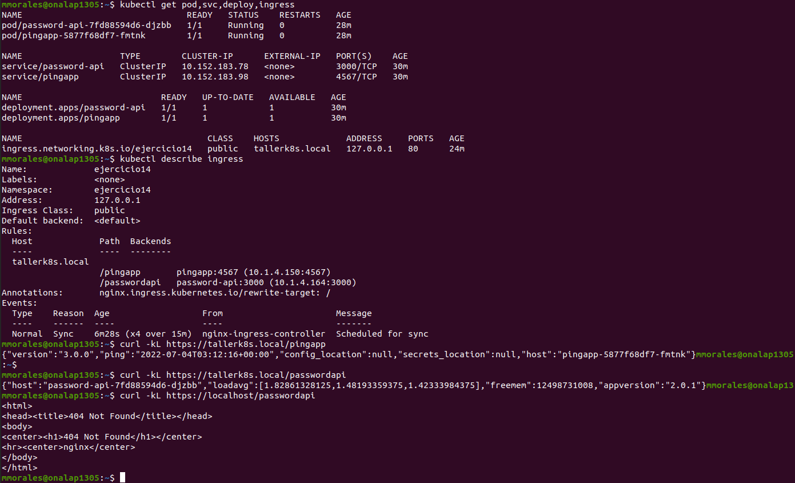

# Ejercicio 14

Se realizo el ejercicio con  microk8s 
```bash
$ microk8s enable ingress
Enabling Ingress
ingressclass.networking.k8s.io/public created
namespace/ingress created
serviceaccount/nginx-ingress-microk8s-serviceaccount created
clusterrole.rbac.authorization.k8s.io/nginx-ingress-microk8s-clusterrole created
role.rbac.authorization.k8s.io/nginx-ingress-microk8s-role created
clusterrolebinding.rbac.authorization.k8s.io/nginx-ingress-microk8s created
rolebinding.rbac.authorization.k8s.io/nginx-ingress-microk8s created
configmap/nginx-load-balancer-microk8s-conf created
configmap/nginx-ingress-tcp-microk8s-conf created
configmap/nginx-ingress-udp-microk8s-conf created
daemonset.apps/nginx-ingress-microk8s-controller created
Ingress is enabled
```

Lei un poco la documentacion oficial https://kubernetes.io/docs/concepts/services-networking/ingress/ y tambien la documentacion de microk8s para ingress https://microk8s.io/docs/addon-ingress

Hice los deployments de ambos proyectos junto a sus respectivos servicios.
Luego cree el manifest del ingress.

Para poder hacer el match con la regla de `host` agregue al archivo `/etc/hosts` -> `127.0.0.1  tallerk8s.local` y asi apunte al ingress en localhost.

Dejo una captura de los objetos, como los endpoints funcionan, y como cuando no matchea la regla de `host` devuelve un 404

